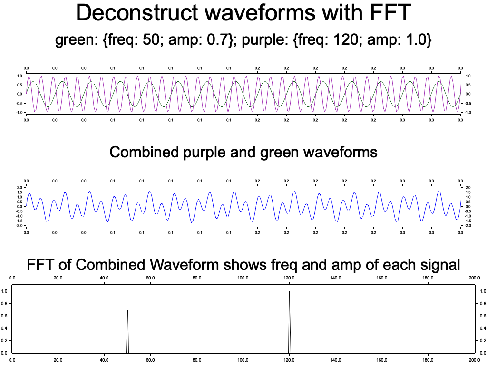
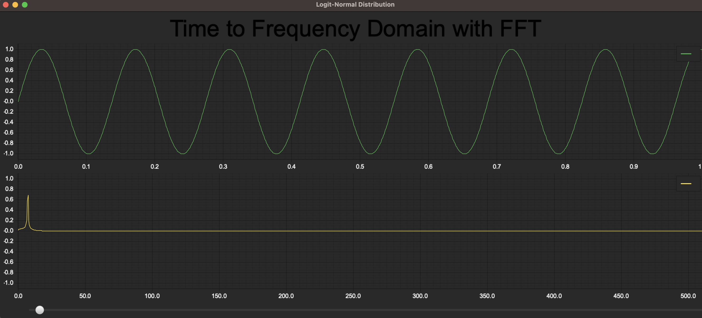

# Cooley-Tukey FFT in Rust

implemented cooley-tukey fft and ifft in Rust with documentation, tests, and examples galore.

## examples

`output to file`  


`interactive window`  


## purpose

The reason for creating this is that I wanted to practice rust and get more familiar with the fft algorithm.

## prerequisites

need to have rust installed
```shell
curl --proto '=https' --tlsv1.2 https://sh.rustup.rs -sSf | sh
```

## getting started

clone this repo and read the documentation

*OPTIONAL: using github codespace*
- create a code space
- install rust in that code space
- start using cargo commands
- "thats it and that's all."

## documentation

run the following once you have cloned the repo 
```shell
cargo doc --open
```
NOTE: if you just installed rust, you may need to open a new shell for `cargo` to be recognized as a command

## running examples

to run the examples, just call use the following command with the name of the example file
```shell
cargo run --example <example_name>
```

## future work / improvements
https://docs.rs/plotters/latest/plotters/https://docs.rs/plotters/latest/plotters/√◊
- add parallelism with threads to speed up the algorithm
- pull out the redundant and costly weight (omega) operations that are based on N outside the recursion  
  since they only need to be calculated once for each N
- use the lib by playing back an .mp3 file while graphing its frequency domain
- use the lib by creating a convolution reverb; try it out on some audio files
  - drum hits
  - voice recordings

## binary example crate

[article](https://www.mathworks.com/help/matlab/ref/fft.html) on how to plot the FFT  
[the source on github](https://github.com/plotters-rs/plotters) and 
[rust docs](https://docs.rs/plotters/latest/plotters/) for plotting in rust
